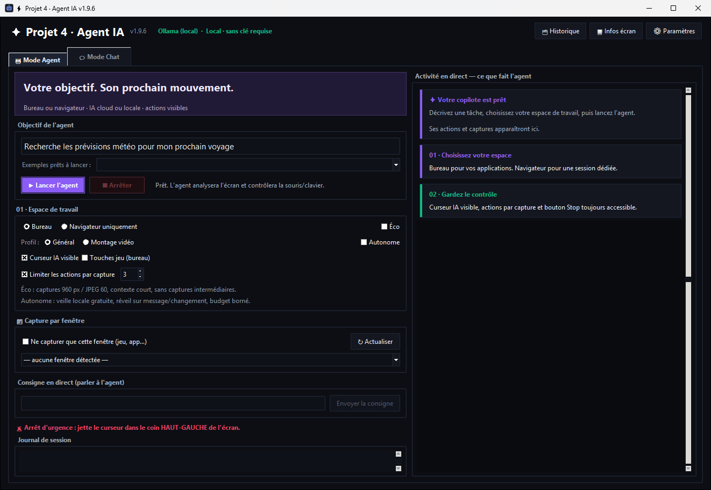
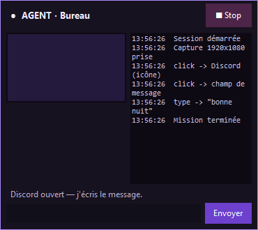

<div align="center">

# ✦ Projet 4, agent IA

### Votre objectif. Son prochain mouvement.

**Application Windows native · Bureau & navigateur · IA cloud & locale**


[Installation](docs/INSTALLATION.md) · [Utilisation](docs/UTILISATION.md) · [IA locale](docs/IA_LOCALE.md) · [Développement](docs/DEVELOPPEMENT.md) · [Toutes les versions](https://github.com/Sayan4448/projet-4-agent-ia/releases)

</div>

Un assistant qui observe, agit et vous montre ce qu’il fait. Décrivez votre objectif,
choisissez **Bureau** ou **Navigateur uniquement**, puis suivez ses actions dans une
interface sombre à accents violets. Un curseur IA avec halo indique les clics ; un
bandeau optionnel affiche l’état pendant l’analyse et disparaît avant les interactions.
La discussion est réduite pendant la mission ; **Ctrl + Maj + F12** arrête l’agent.

Projet indépendant, avec une direction visuelle inspirée des assistants de bureau
comme Neural Agent ; aucune affiliation ni reprise de leur marque.





## Fonctionnalités

| | Ce que vous pouvez faire |
|---|---|
| **Bureau Windows** | Ouvrir des applications, cliquer, écrire, utiliser le clavier et PowerShell. |
| **Navigateur uniquement** | Piloter une session Edge/Chrome dédiée, sans injection de souris/clavier sur le bureau. |
| **Curseur virtuel** | Flèche bleue qui reste à l’endroit du clic (5 s par défaut, réglable), halo animé, indicateur d’activité flottant. |
| **Actions par capture** | **1 à 3** actions maximum (défaut : 3), avec nouvelle observation après un clic ou une navigation. |
| **Souris indépendante** | Entrées virtuelles Windows par défaut, sans déplacer le pointeur ; certaines applications ne les acceptent pas. Aucun repli physique automatique. |
| **Mémoire** | Préférences explicites partagées entre Chat et Agent, consultables, effaçables et désactivables dans les paramètres. |
| **Apparence** | Couleur d’accent, taille du texte Chat et visibilité du bandeau réglables. |
| **Mode éco** | Images limitées à 960 px, JPEG 60, historique réduit, captures intermédiaires désactivées. |
| **IA cloud** | Six fournisseurs ; rotation des clés et bascule vers un autre fournisseur cloud configuré en cas d’échec. |
| **IA locale** | Ollama et LM Studio, adresse configurable, liste des modèles et test de connexion. |
| **Chat** | Conversation et analyse de captures jointes. |
| **Discussions** | Historique local, favoris, création, réouverture et suppression. |
| **Montage vidéo** | Profil pour Premiere Pro, CapCut et DaVinci Resolve, avec raccourcis et vérification visuelle. |
| **Mouvement & audio** | Séquence de 1–6 s (4 images max), enregistrement vidéo MP4 (1–30 s) et analyse d’un fichier audio explicitement indiqué. |
| **Agent autonome** | Bandeau interactif, messages en direct, veille locale et budget IA strict. |
| **Historique Agent** | Chaque run est enregistré (objectif, pensées, actions, réponses) et relisible via 🗂 Historique. |
| **Tâches complètes** | Vérification de la fenêtre principale, fermeture des pubs/popups et attente de chargement (15 s). |

## Installation rapide

1. Ouvrir les [**Releases**](https://github.com/Sayan4448/projet-4-agent-ia/releases/latest) et télécharger `Projet4-AgentIA-1.9.6.msi`.
2. Lancer le MSI puis ouvrir **Projet 4, agent IA** depuis le Bureau ou le menu Démarrer.
3. Dans **Paramètres**, choisir un fournisseur, charger les modèles, sélectionner un
   modèle puis **Tester la connexion**. Pour les captures, il faut un modèle avec vision.
4. Écrire un objectif et cliquer sur **Lancer l’agent**.

**Python et les bibliothèques de l’application sont embarqués** : aucune installation
de Python, pip ou Playwright à faire pour utiliser le MSI. Le mode navigateur utilise
Microsoft Edge ou Google Chrome installé sur le PC. Ollama/LM Studio et leurs modèles
restent optionnels et se configurent séparément : [guide IA locale](docs/IA_LOCALE.md).

Une version portable `AgentScreen.exe` est aussi produite. Le nom de fichier interne
est conservé pour les mises à jour ; l’application porte bien le nom **Projet 4, agent IA**.

## Exemples

- **Bureau** : « Ouvre le Bloc-notes et écris Bonjour. »
- **Navigateur** : « Recherche la météo à Lyon et résume les prévisions. »
- **Chat** : « Explique-moi ce message d’erreur » avec une capture jointe.

Les discussions du Chat sont conservées localement. Le titre est créé sans IA et les
favoris restent en haut. Le mode éco Chat envoie par défaut seulement les 6 messages
précédents et limite la réponse à 700 tokens ; ces valeurs sont réglables et s’appliquent
quand le mode éco Chat est actif. Sinon, l’app utilise 10 messages et 2 048 tokens.

Le mode navigateur utilise son propre profil, distinct de vos profils personnels.
Il ouvre une fenêtre dédiée et la ferme à la fin de la tâche. Les connexions conservées
dans son profil peuvent être réutilisées lors d’une prochaine session.

## Lancer et modifier les sources

Dans PowerShell, depuis le dossier du projet :

```powershell
py -3.11 -m venv .venv
.\.venv\Scripts\python.exe -m pip install -r requirements.txt
.\.venv\Scripts\python.exe run_app.py
```

```powershell
# Tests hors API externe
.\.venv\Scripts\python.exe -m unittest discover -s scripts -p "test_*.py" -v
# Test interactif de l’interface Windows et de la saisie
.\.venv\Scripts\python.exe -m scripts.smoke_desktop
# Création de l’exécutable et du MSI
powershell -ExecutionPolicy Bypass -File scripts/build_windows.ps1
```

Voir [Développement](docs/DEVELOPPEMENT.md) pour la structure complète, les dépendances,
les tests, la compilation, l’ajout d’actions et la publication des versions.

## Données et limites

- Les clés et captures restent dans le dossier de données local, jamais dans le dépôt.
  Avec une IA cloud, le prompt et les captures jointes vont au fournisseur sélectionné,
  ou à un autre fournisseur cloud configuré si le premier échoue.
- Le mode Bureau peut exécuter PowerShell avec les droits de votre session. Utilisez-le
  seulement pour des tâches et contenus auxquels vous faites confiance.
- Une session **Ollama/LM Studio ne bascule jamais vers une IA cloud**. L’adresse du
  serveur peut toutefois être distante si vous la changez.
- Le mode navigateur restreint les **outils de l’agent** à la page. Ce n’est pas un
  environnement sandbox de sécurité pour exécuter des pages malveillantes.
- La reconnaissance et la précision dépendent du modèle choisi. Les erreurs de quota
  (429) et un serveur local arrêté doivent être résolus côté fournisseur/serveur.
- Stop interrompt l’attente de l’IA et les pauses. Une commande système ou une navigation
  déjà en cours se termine ou atteint son délai avant l’arrêt complet.
- Une seule tâche par processus ; ne lancez pas deux instances pour piloter le même bureau.
- Le binaire n’est pas signé : Windows peut afficher une demande de confirmation.

[Historique des versions](CHANGELOG.md) · [Vérifications réalisées](docs/VALIDATION.md) · [Contribuer](CONTRIBUTING.md)
